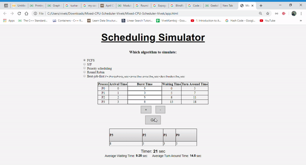

# Mixed CPU Scheduler

This is a web app that provides a comprehensive simulation of CPU Scheduling Algorithms.
It includes the design and development of a new CPU Scheduling Algorithm (the **Best Job First Algorithm**).


### CPU Scheduling Algorithms included:
1.   First Come First Serve (FCFS)
2.   Shortest Job First (SJF)
3.   Priority Scheduling
4.	 Round Robin with a variable Time Quantum
5.	 Best Job First (New)

### Demo:

<div align='center'>

</div>

### Link to Working Project:https://cpu-scheduler.netlify.app/

### Instructions
```
git clone https://github.com/github2k20/Mixed-CPU-Scheduler.git
cd Mixed-CPU-Scheduler
google-chrome app.html  or  firefox app.html
```


### Contributors:
1.	 [Divyansh Kumar Singh(2018-IMT-031)](https://github.com/)
2.	 [Harsh Walia (2018-IMT-036)](https://github.com/harshwalia36)
3.	 [Nikhil Choudhary (2018-IMT-058)](https://github.com/)
4. 	 [Priyansh Rastogi (2018-IMT-073)](https://github.com/github2k20)
5. 	 [Swatik Paul (2018-IMT-100)](https://github.com/swatikpl44)
6.	 [Vivek Kamboj (2018-IMT-109)](https://github.com/Vivek-Kamboj)


